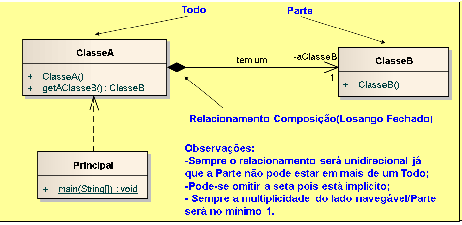

# Exemplo de implementação de relacionamento composição em Java.

## Contextualização

- Programa em Java que demostra a implementação do relacionamento composição "tem um". 
- Uma forma de agregação com propriedade bem definida e tempo de vida coincidente das partes pelo todo.  
- As partes com multiplicidade não fixada poderão ser criadas após a própria composição, mas uma vez criadas, vivem e morrem com ela.  
- Estas partes também podem ser removidas explicitamente antes da morte do elemento composto. 
- Um objeto poderá ser somente parte de uma composição em determinado momento.
- O projeto foi desenvolvido no NetBeans deve ser chamado relacionamento_uml_composicao_java. 
- Utiliza o Apache Maven para a automatização da construção. 

## Diagrama de classes

## Arquivo do projeto

O arquivo Modelo.EAP é o projetodo sistema utilizando ferramanta CASE Enterprise Arquitect.

## Outros arquivos

- pom.xml - Arquivo de configuração da ferramenta de automação Maven.
- *.bat - Arquivos de lote(Batch) de console para tarefas compilar, executar, documentar, empacotar e limpar o projeto.